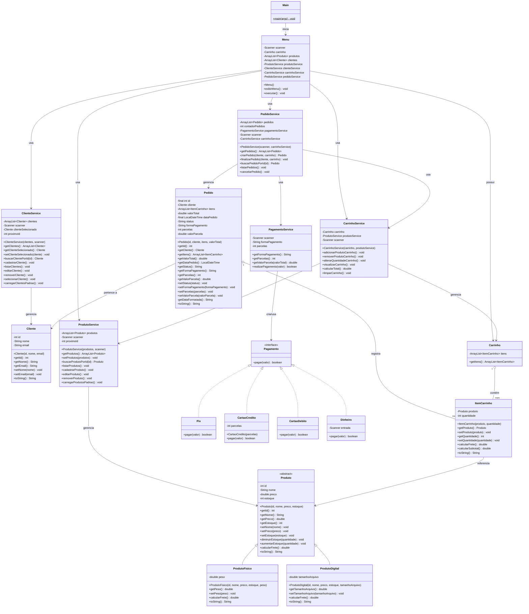

# 🛒 Carrinho de Compras


Sistema de Carrinho de Compras em Java que simula o fluxo de vendas de um e-commerce (catálogo, carrinho, pagamento e pedidos), rodando localmente via linha de comando.

O projeto foi construído com foco em **Programação Orientada a Objetos**, aplicando conceitos como herança, polimorfismo, interfaces e separação de responsabilidades em camadas (Model / Service / View).

---

## 📑 Sumário

- [Funcionalidades](#-funcionalidades)
- [Arquitetura do Projeto](#-arquitetura-do-projeto)
- [Estrutura de Pastas](#-estrutura-de-pastas)
- [Diagrama UML Completo](#-diagrama-uml-completo)
- [Regras de Negócio](#-regras-de-negócio)
- [Pré-requisitos](#-pré-requisitos)
- [Downloads / Executáveis](#-downloads--executáveis)
- [Como Executar](#-como-executar)
- [Menu do Sistema](#-menu-do-sistema)
- [Exemplo de Uso](#-exemplo-de-uso)
- [Tecnologias e Conceitos Aplicados](#-tecnologias-e-conceitos-aplicados)
- [Possíveis Melhorias Futuras](#-possíveis-melhorias-futuras)
- [Autor](#-autor)
- [Licença](#-licença)

---

## ✨ Funcionalidades

### 👤 Clientes
- Cadastrar novo cliente
- Listar todos os clientes
- Selecionar um cliente para realizar a compra
- Editar e remover clientes

### 📦 Produtos
- Cadastrar produtos **Físicos** (com peso, usado no cálculo de frete) ou **Digitais** (com tamanho de arquivo, sem frete)
- Listar produtos disponíveis
- Editar produtos existentes
- Remover produtos
- Controle automático de estoque

### 🛒 Carrinho
- Adicionar produtos ao carrinho (com validação de estoque)
- Remover produtos do carrinho (devolve item ao estoque)
- Alterar a quantidade de um item já adicionado
- Visualizar o carrinho com subtotal, frete e total geral

### 💳 Pagamento
- **PIX** — aplica 5% de desconto automático sobre o valor total
- **Cartão de Crédito** — parcelamento dinâmico (2x, 6x ou 12x, de acordo com o valor da compra)
- **Cartão de Débito** — pagamento à vista
- **Dinheiro** — calcula o troco automaticamente

### 📋 Pedidos
- Finalizar pedido (associa cliente + itens do carrinho + pagamento)
- Consultar histórico de pedidos realizados
- Cancelar pedido (devolve os produtos ao estoque)

---

## 🏗 Arquitetura do Projeto

O projeto segue uma organização em camadas inspirada no padrão **MVC**, separando claramente:

| Camada | Pacote | Responsabilidade |
|---|---|---|
| **Model** | `Model` | Entidades de domínio (dados e regras próprias do objeto) |
| **Service** | `Service` | Regras de negócio e orquestração das operações |
| **View** | `View` | Interação com o usuário via console (menu) |
| **Pagamento** | `Pagamento` | Estratégias de pagamento (padrão *Strategy*) |

Além disso, o pacote `Pagamento` implementa o **padrão de projeto Strategy**: a interface `Pagamento` define o contrato `pagar(double valor)`, e cada forma de pagamento (`Pix`, `CartaoCredito`, `CartaoDebito`, `Dinheiro`) fornece sua própria implementação, permitindo adicionar novas formas de pagamento sem alterar o `PagamentoService`.

A classe `Produto` é **abstrata** e utiliza **polimorfismo** para o cálculo de frete: cada subtipo (`ProdutoFisico`, `ProdutoDigital`) implementa `calcularFrete()` à sua maneira.

---

## 📂 Estrutura de Pastas

```
CarrinhoDeCompras/
├── Main.java                      # Ponto de entrada da aplicação
├── Model/
│   ├── Cliente.java                # Entidade Cliente
│   ├── Produto.java                 # Classe abstrata base de produto
│   ├── ProdutoFisico.java           # Produto com peso e cálculo de frete
│   ├── ProdutoDigital.java          # Produto digital (frete = 0)
│   ├── ItemCarrinho.java            # Item do carrinho (produto + quantidade)
│   ├── Carrinho.java                # Coleção de itens do carrinho
│   └── Pedido.java                  # Pedido finalizado (snapshot da compra)
├── Pagamento/
│   ├── Pagamento.java               # Interface (Strategy)
│   ├── Pix.java                     # Pagamento via PIX (5% de desconto)
│   ├── CartaoCredito.java           # Pagamento parcelado
│   ├── CartaoDebito.java            # Pagamento à vista
│   └── Dinheiro.java                # Pagamento em espécie (com troco)
├── Service/
│   ├── ClienteService.java          # Regras de negócio de clientes
│   ├── ProdutoService.java          # Regras de negócio de produtos
│   ├── CarrinhoService.java         # Regras de negócio do carrinho
│   ├── PagamentoService.java        # Orquestra a escolha da forma de pagamento
│   └── PedidoService.java           # Finalização, histórico e cancelamento de pedidos
└── View/
    └── Menu.java                    # Menu interativo via console
```

---

## 🧩 Diagrama UML Completo

Diagrama de classes completo do sistema, com atributos, métodos e todos os relacionamentos (herança, implementação, associação, agregação e dependência) entre as camadas `Model`, `Pagamento`, `Service` e `View`.

> 💡 O diagrama abaixo usa a sintaxe [Mermaid](https://mermaid.js.org/), renderizada **nativamente pelo GitHub** ao visualizar este arquivo no navegador.



---

## 📐 Regras de Negócio

| Regra | Detalhe |
|---|---|
| **Frete de produto físico** | `peso (kg) × R$ 12,00` |
| **Frete de produto digital** | `R$ 0,00` (sem frete) |
| **Desconto no PIX** | 5% sobre o valor total da compra |
| **Parcelamento no cartão de crédito** | Até 2x se o total for ≤ R$ 500; até 6x se ≤ R$ 1.500; até 12x se > R$ 1.500 |
| **Troco em dinheiro** | Calculado como `valor recebido − valor da compra` |
| **Estoque** | Reduzido ao adicionar item ao carrinho; devolvido ao remover item do carrinho ou cancelar pedido |
| **Cancelamento de pedido** | Só é possível se o pedido não estiver com status `CANCELADO`; os itens retornam ao estoque |
| **Status do pedido** | `PENDENTE` → `PAGO` → (opcionalmente) `CANCELADO` |

---

## ✅ Pré-requisitos

O pré-requisito depende de **como** você vai rodar o sistema:

| Forma de execução | Requisito |
|---|---|
| `.jar` (multiplataforma) | **Java JDK/JRE 17+** instalado |
| `.exe` (Windows) | Nenhum — o Java já vem empacotado junto no executável |
| `.AppImage` (Linux) | Nenhum — o Java já vem empacotado junto no executável |

Para rodar via `.jar`, verifique sua instalação do Java com:

```bash
java -version
```

---

## 💾 Downloads / Executáveis

Além do código-fonte e do `.jar`, o projeto disponibiliza **executáveis nativos**, prontos para uso, para os principais sistemas operacionais — sem necessidade de instalar o Java separadamente:

| Sistema Operacional | Arquivo | Como executar |
|---|---|---|
| 🪟 **Windows** | `CarrinhoDeCompras.exe` | Baixe o arquivo e dê duplo clique, ou execute pelo terminal: `CarrinhoDeCompras.exe` |
| 🐧 **Linux** | `CarrinhoDeCompras.AppImage` | Dê permissão de execução e rode: `chmod +x CarrinhoDeCompras.AppImage && ./CarrinhoDeCompras.AppImage` |
| ☕ **Qualquer SO** | `CarrinhoDeCompras.jar` | `java -jar CarrinhoDeCompras.jar` (requer Java instalado) |

> 📥 Os executáveis (`.exe` e `.AppImage`) ficam disponíveis na seção **[Releases](../../releases)** deste repositório, junto com o `.jar`.

### Como os executáveis são gerados

Os instaladores nativos são construídos a partir do `.jar` utilizando o **[`jpackage`](https://docs.oracle.com/en/java/javase/17/jpackage/)**, ferramenta oficial do JDK para empacotar aplicações Java em executáveis nativos (já inclui um runtime Java embutido, dispensando instalação prévia):

```bash
# Gerar o executável para Windows (.exe) — deve ser rodado em ambiente Windows
jpackage --input . --name CarrinhoDeCompras --main-jar CarrinhoDeCompras.jar ^
  --main-class Main --type exe --win-console

# Gerar o AppImage para Linux — deve ser rodado em ambiente Linux
jpackage --input . --name CarrinhoDeCompras --main-jar CarrinhoDeCompras.jar \
  --main-class Main --type app-image
# Em seguida, empacote a pasta gerada em .AppImage com o appimagetool:
# https://github.com/AppImage/AppImageKit
```

---

## ▶️ Como Executar

### Opção 1 — Executável nativo (recomendado para usuários finais)

- **Windows:** duplo clique em `CarrinhoDeCompras.exe`
- **Linux:** `chmod +x CarrinhoDeCompras.AppImage && ./CarrinhoDeCompras.AppImage`

### Opção 2 — Executando o `.jar` já compilado

```bash
java -jar CarrinhoDeCompras.jar
```

### Opção 3 — Compilando a partir do código-fonte

```bash
# Compilar todos os arquivos .java para a pasta "bin"
javac -d bin $(find . -name "*.java")

# Executar a aplicação
java -cp bin Main
```

### Opção 4 — Gerando o próprio `.jar`

```bash
# Após compilar os .class para a pasta "bin"
cd bin
jar cfe ../CarrinhoDeCompras.jar Main .
cd ..
java -jar CarrinhoDeCompras.jar
```

---

## 🗂 Menu do Sistema

Ao iniciar a aplicação, o seguinte menu é exibido:

```
====================================
   SISTEMA DE CARRINHO DE COMPRAS
====================================
1  - Cadastrar Cliente
2  - Listar Clientes
3  - Selecionar Cliente
4  - Cadastrar Produtos
5  - Listar Produtos
6  - Editar Produto
7  - Adicionar Produto ao Carrinho
8  - Remover Produto do Carrinho
9  - Alterar Quantidade do Carrinho
10 - Visualizar Carrinho
11 - Finalizar Pedido
12 - Histórico de Pedidos
13 - Cancelar Pedido
0  - Sair
```

> ⚠️ **Atenção:** é necessário **cadastrar um cliente e selecioná-lo** (opções 1 e 3) e **cadastrar/adicionar produtos ao carrinho** (opções 4 e 7) antes de finalizar um pedido (opção 11).

---

## 💡 Exemplo de Uso

```text
Escolha uma opção: 1
========== CADASTRO DE CLIENTE ==========
ID: 1
Nome: Ana Souza
E-mail: ana@email.com
Cliente cadastrado com sucesso!

Escolha uma opção: 3
Digite o ID do cliente: 1
Cliente selecionado com sucesso!

Escolha uma opção: 4
====== CADASTRO DE PRODUTO ======
ID: 1
Nome: Mouse Gamer
Preço: 150.00
Estoque: 10
Tipo do Produto
1 - Produto Físico
2 - Produto Digital
Escolha: 1
Peso (kg): 0.8
Produto cadastrado com sucesso!

Escolha uma opção: 7
Digite o ID do produto: 1
Quantidade: 2
Produto adicionado ao carrinho com sucesso!

Escolha uma opção: 11
========== FORMA DE PAGAMENTO ==========
1 - PIX
2 - Cartão de Crédito
3 - Cartão de Débito
4 - Dinheiro
Escolha uma opção: 1

===== Pagamento realizado via PIX =====
Valor da compra: R$ 319.20
Desconto: R$ 15.96
Valor final: R$ 303.24
Pagamento realizado com sucesso!
```

---

## 🛠 Tecnologias e Conceitos Aplicados

- **Java (JDK 17+)** — 100% Java puro, sem dependências externas
- **Programação Orientada a Objetos**
  - Herança (`Produto` → `ProdutoFisico` / `ProdutoDigital`)
  - Polimorfismo (`calcularFrete()`)
  - Abstração (classe abstrata `Produto`)
  - Interfaces (`Pagamento`)
- **Padrão de Projeto Strategy** — para as formas de pagamento
- **Arquitetura em camadas** — separação entre `Model`, `Service` e `View`
- **Coleções (`ArrayList`)** para persistência em memória de clientes, produtos e pedidos
- **`java.time`** — geração de data/hora do pedido com `LocalDateTime` e formatação com `DateTimeFormatter`

> ℹ️ Os dados são armazenados **em memória** durante a execução (não há persistência em banco de dados ou arquivo); ao encerrar o programa, os dados são perdidos.

---

## 🚀 Possíveis Melhorias Futuras

- [ ] Persistência de dados em banco de dados (H2, MySQL, PostgreSQL) ou arquivos (JSON/CSV)
- [ ] Testes automatizados (JUnit)
- [ ] Interface gráfica (Swing/JavaFX) ou API REST (Spring Boot)
- [ ] Validação de e-mail e CPF do cliente
- [ ] Autenticação de usuários/administradores
- [ ] Sistema de cupons de desconto
- [ ] Geração de nota fiscal / recibo em PDF

---

## 👤 Autor

**Eduardo Torres Do Ó**  
Desenvolvedor Full Stack

- Email: edutorres_dev@hotmail.com
- Linkedin: https://www.linkedin.com/in/eduardo-torres-do-%C3%B3-576085385/

---

## 📄 Licença

Este projeto está disponível sob a licença MIT. Sinta-se livre para usá-lo, modificá-lo e distribuí-lo.
